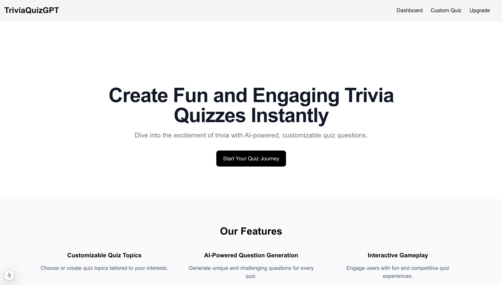
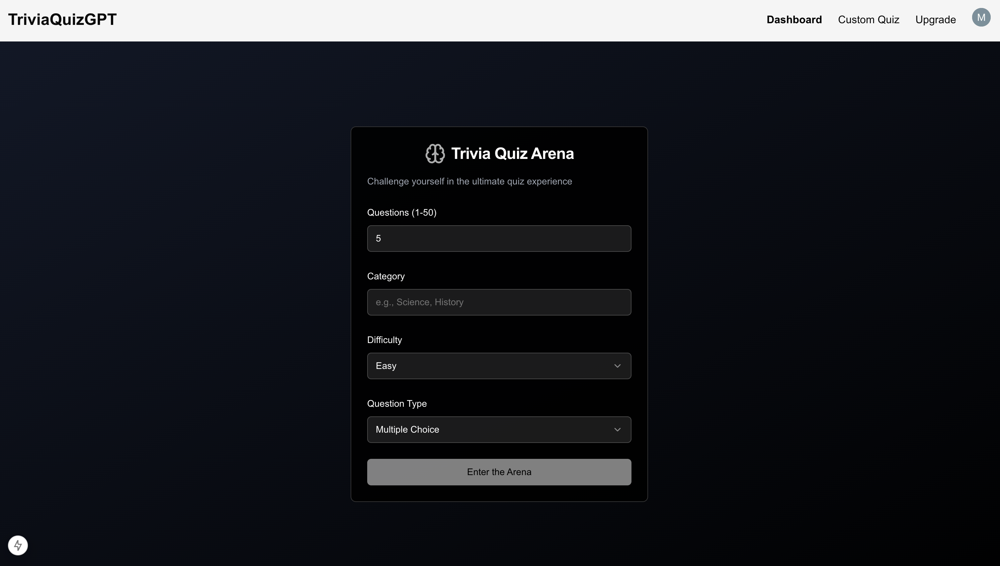
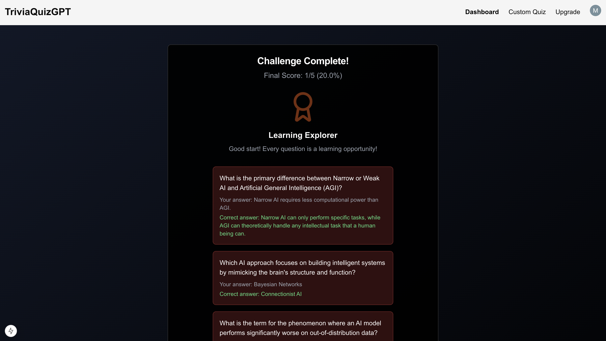
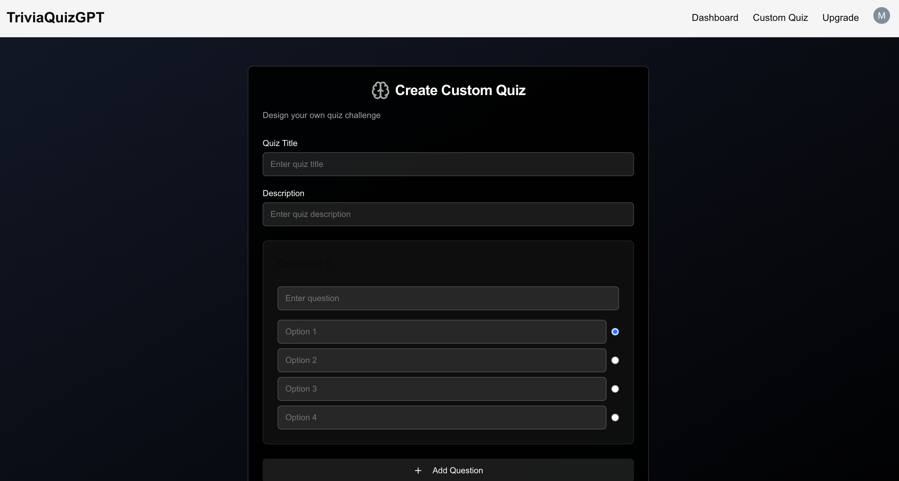

# Trivia Quiz GPT
An AI-powered trivia quiz app that allows users to create custom quizzes, attempt them, and view results at the end for an interactive quiz experience.

## Table of Contents
  - [Live Demo](#live-demo)
  - [Screenshots](#screenshots)
  - [Features](#features)
  - [Technologies Used](#technologies-used)
  - [Getting Started](#getting-started)
    - [Prerequisites](#prerequisites)
    - [Installation](#installation)
  - [How to use the application](#how-to-use-the-application)
  - [API Reference](#api-reference)
  - [Use Cases & Future Enhancements](#use-cases-and-future-enhancements)
  - [Contributing](#contributing)
  - [License](#license)
  - [Acknowledgments](#acknowledgments)
  - [FAQ](#faq)

## Live Demo

Live demo - [Trivia Quiz GPT](https://trivia-gpt-nine.vercel.app/)

## Features

- Generate trivia quizzes based on AI-powered questions
- Personalized quiz categories and difficulty levels
- Interactive UI for participants to answer questions
- AI-driven result analysis
- Responsive design for various devices

## Technologies Used

- Next.js for Frontend and Backend
- XAI Grok-beta Model for AI-Generated Questions
- Clerk for authentication
- Shadcn library for adding interactive elements

## Getting Started

### Prerequisites

- Next.js
- Clerk credentials
- XAI API key

### Installation

1. Clone the repository:
 
```
git clone https://github.com/0xmetaschool/TriviaQuizGPT.git
cd TriviaQuizGPT
```

2. Install dependencies:
```
npm install
```

This will install the following key dependencies:
- next: React framework for production
- react and react-dom: Core React libraries
- clerk: user authentication library

Note: The exact versions of these dependencies will be determined by your package.json file.

3. Set up environment variables:

- Create a .env.local file in the root directory
- Add the following variables:
```
NEXT_PUBLIC_CLERK_PUBLISHABLE_KEY=your_clerk_publishable_key
CLERK_SECRET_KEY=your_clerk_secret_key

NEXT_PUBLIC_CLERK_SIGN_IN_URL=/sign-in
NEXT_PUBLIC_CLERK_SIGN_UP_URL=/sign-up

X_AI_API_KEY=your_X_API_key
```

4. Start the development server
```
  npm run dev
```
5. Open your browser and navigate to `http://localhost:3000`

## Screenshots

<div style="display: flex; justify-content: space-between;">
  
  
</div>
<div style="display: flex; justify-content: space-between;">
  
  
</div>


## How to use the application

1. **Creating a Quiz:**
- Navigate to the "Dashboard" page
- Select quiz categories including number of question, category, difficulty level and questions type
- Based on user slected categories, AI genrates the quiz question and answers, now its time to enter into the Quiz arena
- Users also have the option to create custom quizes as well.

2. **Attempting a quiz:**
- Each question will be presented with multiple choices or with a true/false choices 
- Participant will select their answer and it updates the score and move towards next question

3. **Results and Feedback:**
- Once the quiz is complete, results are shared with the participants

Remember to enjoy the trivia challenges with your friends and have a fun learning!

## Use Cases & Future Enhancements

Here's what you can do with Trivia Quiz GPT and what's coming next:

**Current Use Cases:**
- Personalize quizzes based on interests and difficulty level
- Get detailed results after each quiz
- Able to attempt unlimited customized quizes at this moment

**Coming Soon:**
- Creating quiz rooms including multiplayer support for larger groups to engage simultaneously
- Customizable quiz themes and designs
- Real-time chat and interaction during quiz sessions
- Save and share quiz results with friends
- Integration with social media for sharing quiz results

Want to contribute? Check out our contributing guidelines below!

## Contributing

We love contributions! Here's how you can help make the project even better:

- Fork the project (gh repo fork https://github.com/0xmetaschool/TriviaQuizGPT)
- Create your feature branch (git checkout -b feature/AmazingFeature)
- Commit your changes (git commit -m 'Add some AmazingFeature')
- Push to the branch (git push origin feature/AmazingFeature)
- Open a Pull Request

## License

This project is licensed under the MIT License - see the [LICENSE](https://github.com/0xmetaschool/trivia-quiz-gpt/blob/main/LICENSE) file for details.

## Acknowledgments

- XAI for the Grok-beta API
- Clerk for providing the authentication services

## Quiz
**Q: How do I create a quiz?**
A: To create a quiz, simply provide the quiz details such as category, difficulty level, and number of questions. You can then generate a custom quiz based on your preferences.

**Q: Can I save my progress in a quiz?**
A: Currently, quizzes are designed to be completed in one session. However, we are exploring options to allow users to save and continue quizzes in the future.

**Q: How secure is my data?**
A: We prioritize user privacy and security. All user data is encrypted, and we follow best practices to ensure your information is safe and never shared with third parties.